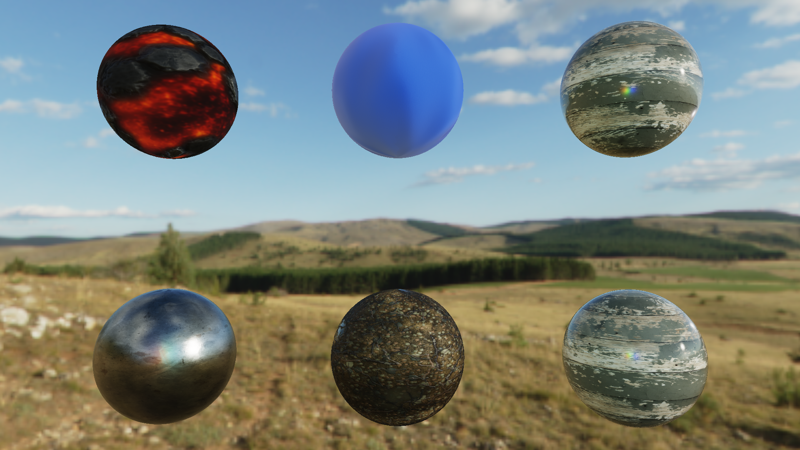
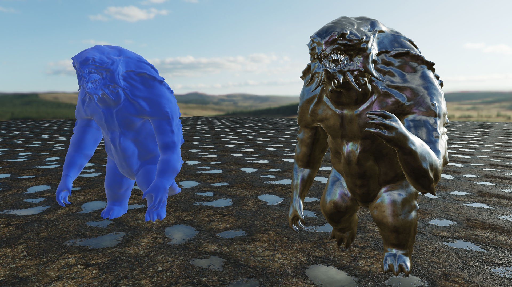
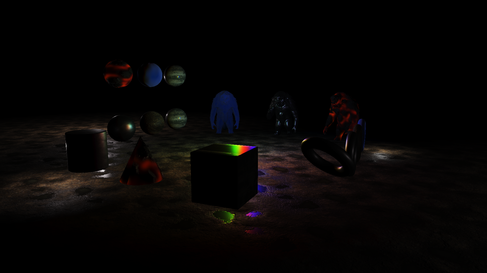
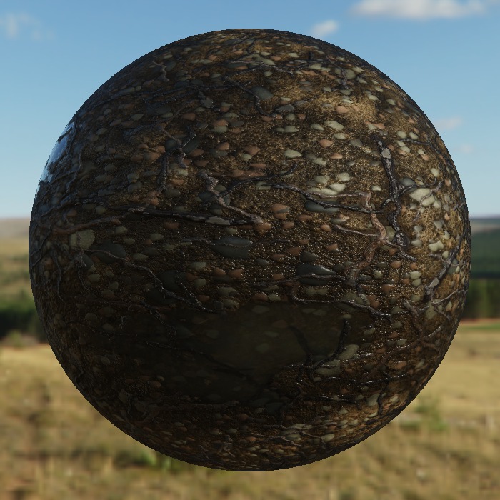
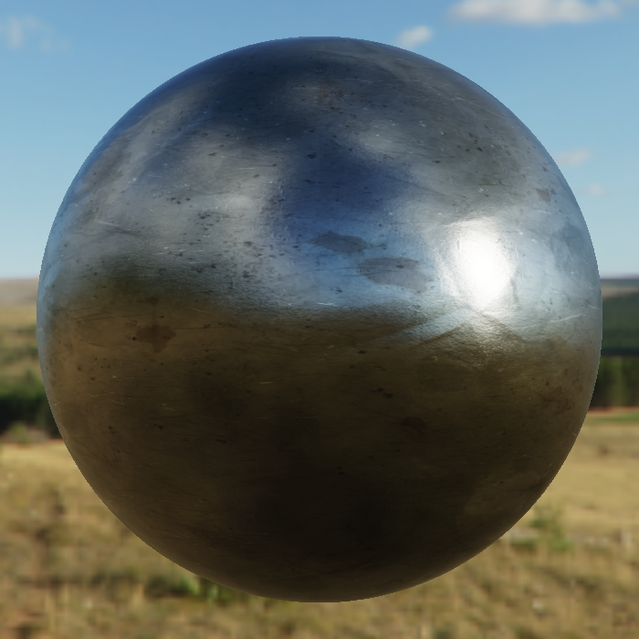
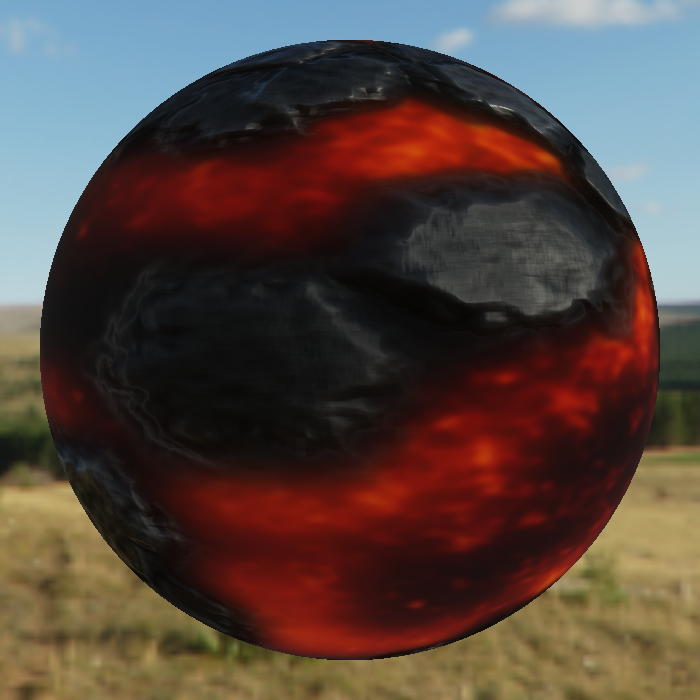
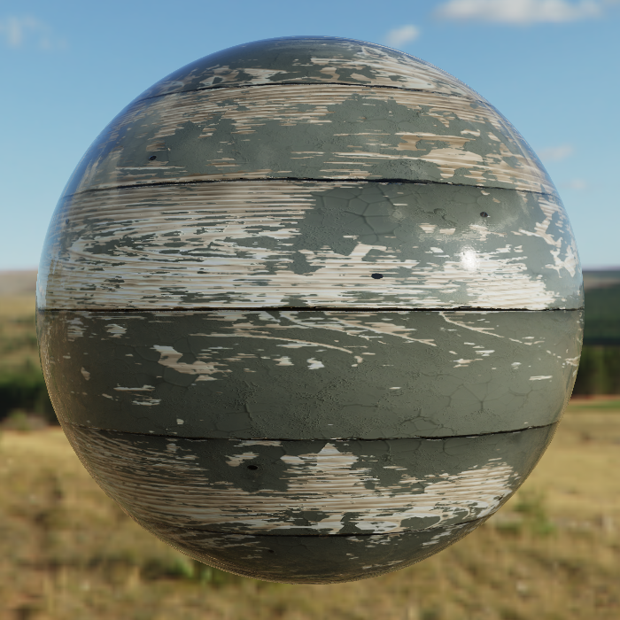
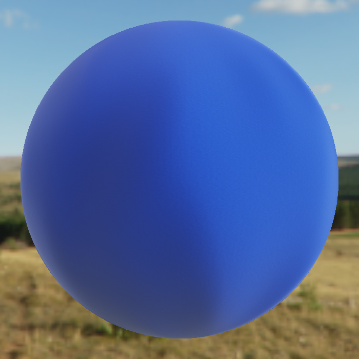

# RIN

RIN (Render It Now) is a real-time, physically based, C++ render engine. The main purpose of this project is to teach myself D3D12 and to explore a few modern rendering techniques. RIN currently only has a D3D12 implementation and only runs on Windows. Feel free to use this as a reference for your own graphics projects if you wish.

## Screenshots

Material Samples:


Skinned Meshes:


Point Lights:


## Features

* Clustered forward rendering
* Frustum culling
* Occlusion culling
* Physically based rendering
* Metallic/roughness workflow materials
* Emissive materials
* Clear coat materials
* Sheen materials
* Cook-Torrance specular BRDF
* Lambertian diffuse BRDF
* Multiple scattering compensation
* Normal mapping
* Ambient occlusion mapping
* Image-based lighting
* Dynamic point lights
* HDR lighting
* HDR skybox
* ACES tonemapping
* Static meshes
* Dynamic meshes
* Skinned meshes
* Dynamic scene editing
* Deferred resource uploading
* Multithreaded

## Materials

The shading implementation in RIN is based on the [Google Filament documentation](https://google.github.io/filament/Filament.html) (see [PBRPS.hlsl](RIN/PBRPS.hlsl)). I highly recommend checking it out if you are curious about implenting your own PBR shaders. Each material has a combination of different parameters which determine the final look. The table below indicates what each texture does and what its channels represent.

| Texture | Use | R | G | B | A |
| --- | --- | --- | --- | --- | --- |
| BaseColor | Albedo for dielectrics, specular for conductors. | Red | Green | Blue | N/A |
| Normal | Tangent space surface normal. | Normal.x | Normal.y | N/A | N/A |
| RoughnessAO | Apparent surface roughness and shadowing. | Roughness | Ambient Occlusion | N/A | N/A |
| Metallic | Whether the surface is dielectric or a conductor. Unused by sheen materials. | Metallic | N/A | N/A | N/A |
| Height | Currently unused. | Height | N/A | N/A | N/A |
| Special/Standard | Unused by standard materials. | N/A | N/A | N/A | N/A |
| Special/Emissive | Emissive color. | Red | Green | Blue | N/A |
| Special/Clear coat | Clear coat tangent space surface normal, apparent roughness, and mask. | Normal.x | Normal.y | Roughness | Mask |
| Special/Sheen | Sheen color. | Red | Green | Blue | N/A |

### Standard Material




[Google Filament BRDF](https://google.github.io/filament/Filament.md.html#toc4.6). See the shader code in RIN [here](RIN/PBRPS.hlsl#L80-L163).

### Emissive Material



See the shader code in RIN [here](RIN/PBRPS.hlsl#L364-L365).

### Clear Coat Material



[Google Filament BRDF](https://google.github.io/filament/Filament.md.html#toc4.9). See the shader code in RIN [here](RIN/PBRPS.hlsl#L165-L280).

### Sheen Material



[Google Filament BRDF](https://google.github.io/filament/Filament.md.html#toc4.12). See the shader code in RIN [here](RIN/PBRPS.hlsl#L286-L353).

## Examples

To initialize RIN you must first create an `HWND` and fill out the `RIN::Config` and `RIN::Settings` structures. See [Test/Main.cpp](Test/Main.cpp#L119-L145) for an example of how to fill out the structures. Then use these to create a `RIN::Renderer`.

```cpp
// Create a Renderer
RIN::Renderer* renderer = RIN::Renderer::create(hwnd, config, settings);
```

Once the renderer has been created you can position the camera and begin adding and modifying elements in the scene.

```cpp
// Position camera
RIN::Camera& camera = renderer->getCamera();
camera.setViewMatrix(viewMatrix);
camera.setPerspective(fovY, aspect, nearZ, farZ);

// Create a dynamic mesh
RIN::DynamicMesh* mesh = renderer->addDynamicMesh(boundingSphere, vertices, vertexCounts, indices, indexCounts, lodCount);

// Create a texture
RIN::Texture* baseColor = renderer->addTexture(RIN::TEXTURE_TYPE::TEXTURE_2D, format, width, height, mipCount, textureData);

// Create a material
RIN::Material* material = renderer->addMaterial(MATERIAL_TYPE_PBR_STANDARD, baseColor, normal, roughnessAO, metallic, height, nullptr);

// Create a dynamic object
RIN::DynamicObject* object = renderer->addDynamicObject(mesh, material);

// Position object
object->setWorldMatrix(worldMatrix);

// Create a light
RIN::Light* light = renderer->addLight();
light->position = { 0.0f, 0.0f, 10.0f };
light->radius = 30.0f;
light->color = { 20.0f, 20.0f, 20.0f };
```

To render with RIN, tell the renderer to show its window, then update the scene and render it.

```cpp
// Show the window
renderer->showWindow();

// Update the scene
renderer->update();

// Render the scene
renderer->render();
```

When integrating RIN into your main loop, you should structure things such that all modifications to the scene happen between calls to `RIN::Renderer::update` and `RIN::Renderer::render` to maximize CPU and GPU usage. See [Test/Main.cpp](Test/Main.cpp#L329-L572) for an example main loop.

```cpp
while(true) {
    // wndProc event processing
    ...

    // Update the scene for the current frame
    renderer->update();

    // Update the scene for the next frame
    if(someCondition) {
        renderer->addStaticObject(mesh, material);
        renderer->removeLight(light);
    }
    armature->bones[0].setWorldMatrix(worldMatrix);
    ...

    // Render the current frame
    renderer->render();
}
```

## Concurrency and Synchronization

RIN is multithreaded internally and handles all of the CPU/GPU synchronization itself. It is strongly recommended to follow the main loop layout shown above to maximize concurrency between the CPU and GPU. RIN is also largely free threaded, which allows for additional concurrency in your application. The exception to this is that you must not modify the scene concurrently with a scene update, but it is perfectly safe to make concurrent modifications to the scene otherwise. The thread safety of each function is documented in its corresponding header file. The main interface of RIN and its thread safety is located in [Renderer.hpp](RIN/Renderer.hpp#L65-L98). If a function is missing thread safety documentation, then it is not thread-safe.

As a general guideline for multithreading an application using the recommended main loop, you should dispatch jobs that modify the scene after calling `RIN::Renderer::update` and wait for them to finish before calling `RIN::Renderer::render`. Both of these functions are multithreaded anyway, so the loss of concurrency from an extra synchronization point will be minimal.

One example of how you could take advantage of this in your application would be a multithreaded scene graph traversal (see [SceneGraph.cpp](Test/SceneGraph.cpp#L170-L195)). Another way you could utilize this would be to load parts of a scene concurrently, for instance in an open world scenario, where you are streaming in different portions of the scene as the character moves through the world.

## DirectXMath

RIN uses [DirectXMath](https://github.com/microsoft/DirectXMath) for linear algebra. DirectXMath is great because it takes advantage of SIMD, but that can also make it slightly more complicated to use. I have written a brief description on how to safely use DirectXMath with RIN [here](RIN/Renderer.hpp#L23-L49). In general, ensure that `XMVECTOR` and `XMMATRIX` types are 16-byte aligned, and follow the [DirectXMath calling conventions](https://docs.microsoft.com/en-us/windows/win32/dxmath/pg-xnamath-internals). Another important thing to note is that matrices in DirectXMath are row-major row vector matrices which are composed from left to right and follow the form *x A* where *x* is a vector and *A* is a matrix. Typically in mathematics we see column vector matrices which are composed from right to left and follow the form *A x*. If you do not want to use DirectXMath, then note that RIN expects that all matrices passed into it to be either row-major row vector matrices (*x A*) or column-major column vector matrices (*A x*). In short, if your matrices are stored in row-major order, then treat them like row vector matrices, and if your matrices are stored in column-major order, then treat them like column vector matrices.

## Allocators

RIN implements three custom allocators which are used to manage GPU memory. These allocators are all free-threaded. Feel free to use them in your own graphics projects.

* [Free List allocator](RIN/FreeListAllocator.hpp)
    * Allocate arbitrarily sized blocks
    * Can suffer from fragmentation
* [Pool allocator](RIN/PoolAllocator.hpp)
    * Allocate fixed size blocks
* [Bump allocator](RIN/BumpAllocator.hpp)
    * Allocate arbitrarily sized blocks
    * Lock-free
    * Must free all allocations at once

## Utilities

### RIN Utilities

* [Static](RIN/Pool.hpp#L31-L100)/[Dynamic pool](RIN/Pool.hpp#L127-L237)
    * Free-threaded
    * Allocates a large chunk of memory up front
    * Suballocates elements within its memory
* [Thread pool](RIN/ThreadPool.hpp)
    * Free-threaded
    * Multithreaded
    * Submit jobs to the pool
    * Wait for them to complete

### Extra Utilities

* [File pool](Test/FilePool.hpp)
    * Free-threaded
    * Multithreaded
    * Submit files to be read into memory
    * Wait on all files or specific ones
* [Scene graph](Test/SceneGraph.hpp)
    * Free-threaded
    * Multithreaded traversal
    * Supports `RIN::DynamicObject`, `RIN::Light`, and `RIN::Bone`
* [Mouse/Keyboard input](Test/Input.hpp)
    * Uses raw input
    * Specify keybinds
* [First](Test/FirstPersonCamera.hpp)/[Third person camera](Test/ThirdPersonCamera.hpp)
    * Computes and updates the view matrix
    * Controlled by user input

## Future Work

There is an endless number of features that could be added to RIN, however these are a few that I'd like to work on.

* Eliminate occlusion culling frame latency. Arseny Kapoulkine explains a nice way of doing this during one of his [Niagra streams](https://youtu.be/YCteLdYdZWQ).
* Allow a dynamic number of lights per cluster to help with high light density areas.
* Multisample anti-aliasing (MSAA).
* Sun shadows with cascaded shadow maps.
* Screen space reflections (SSR).
* Screen space ambient occlusion (SSAO).
* Possibly explore dynamic global illumination, such as Voxel GI.

## References

* [Physically Based Rendering in Filament](https://google.github.io/filament/Filament.html) by Google Filament, used as a reference for the BRDF implementations.
* [Clustered Deferred and Forward Shading](https://www.cse.chalmers.se/~uffe/clustered_shading_preprint.pdf) by Ola Olsson, Markus Billeter, and Ulf Assarsson, used as a reference for the light clustering implementation.
* [A Primer On Efficient Rendering Algorithms & Clustered Shading](http://www.aortiz.me/2018/12/21/CG.html) by Angel Ortiz, used as a reference for the light clustering implementation.
* [Niagra](https://github.com/zeux/niagara) by Arseny Kapoulkine, used as a reference for the occlusion culling implementation.

These references were the main source of information used to create RIN, but more are cited in the code.

## Acknowledgements

* [cmgen](https://github.com/google/filament/tree/main/tools/cmgen) by Google Filament, used to generate the [DFG LUT](RIN/data/DFGLUT.h) for IBL and multiple scattering.
* [Monster - UDIM](https://download.blender.org/demo/UDIM_monster.zip) by Daniel Bystedt, model and armature used in the test application and shown in the screenshots.
* Assets shipped with Adobe Substance 3D Designer, used for the skybox and the metal and wood materials in the test application and shown in the screenshots.
* [Columned Lava Rock PBR Material](https://freepbr.com/materials/columned-lava-rock/) by FreePBR, used for the lava material in the test application and shown in the screenshots.
* [Soft Blanket PBR Material](https://freepbr.com/materials/soft-blanket-pbr/) by FreePBR, used for the blanket material in the test application and shown in the screenshots.